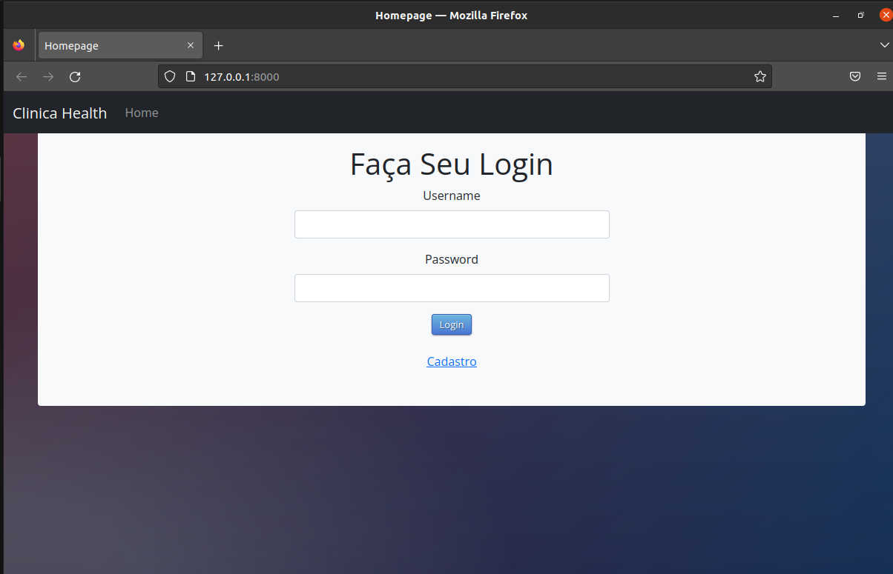

# Sistema Clínico utilizando Rest



>Prototipo para marcar consultas e adicionar médicos e seus horarios e agendas, na área de adm foi usado uma **api** para gerenciar os médicos.

* [Demostração em Vídeo](https://drive.google.com/file/d/1wpmfCAra2aeh2NxdBCL7XXLxXPq-mWSc/view?usp=share_link)

🏫 Atividade acâdemica

## Tecnologias Utilizadas


## 🚀 Processo de Instalação

Para instalar **Clínica**, siga estas etapas:

Linux:
```
git clone https://github.com/Wenderson-Oscar/Clinica.git
virtualenv env
. env/bin/activate
pip install -r requirementes.txt
```

Windows:
```
git clone https://github.com/Wenderson-Oscar/Clinica.git
python -m venv env
env\Scripts\activate
pip install -r requirementes.txt
```

## ☕ Como Utlizar a Aplicação

Para usar **Clínica**, siga estas etapas:

```
python manage.py migrate clientes
python manage.py migrate medico
python manage.py migrate
python manage.py createsuperuser
python manage.py runserver
```
